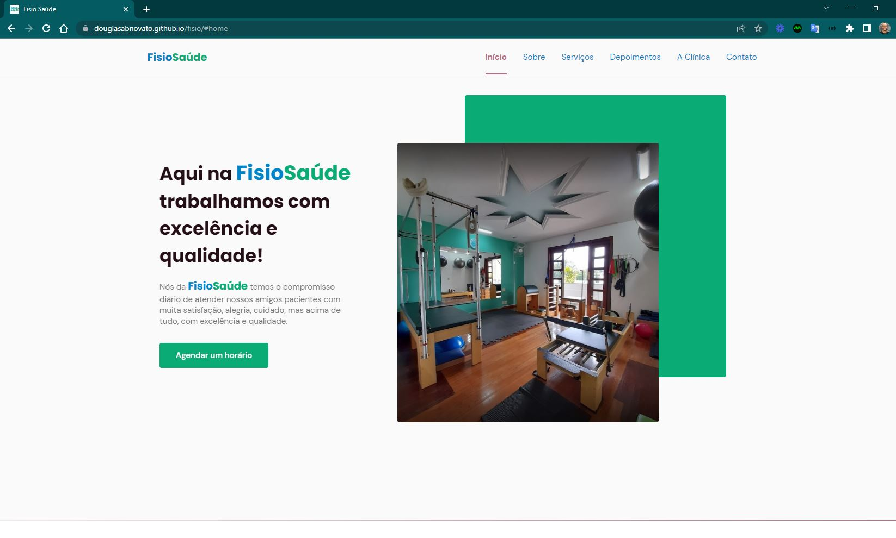
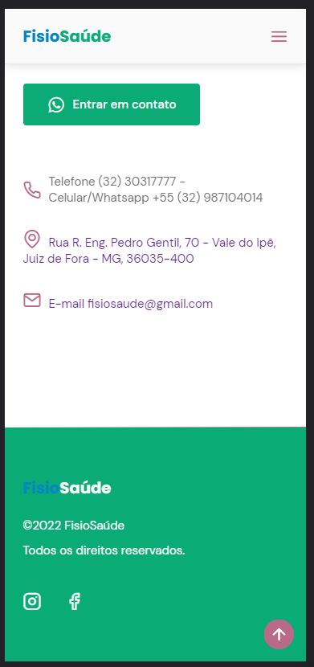
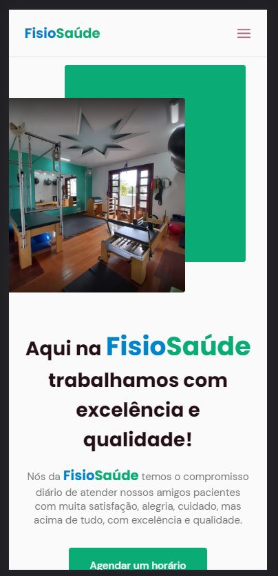
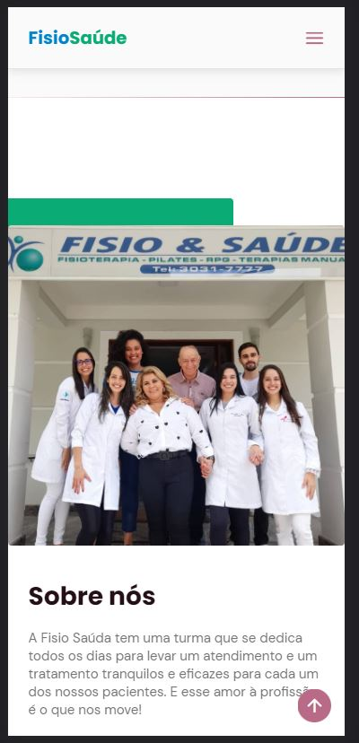
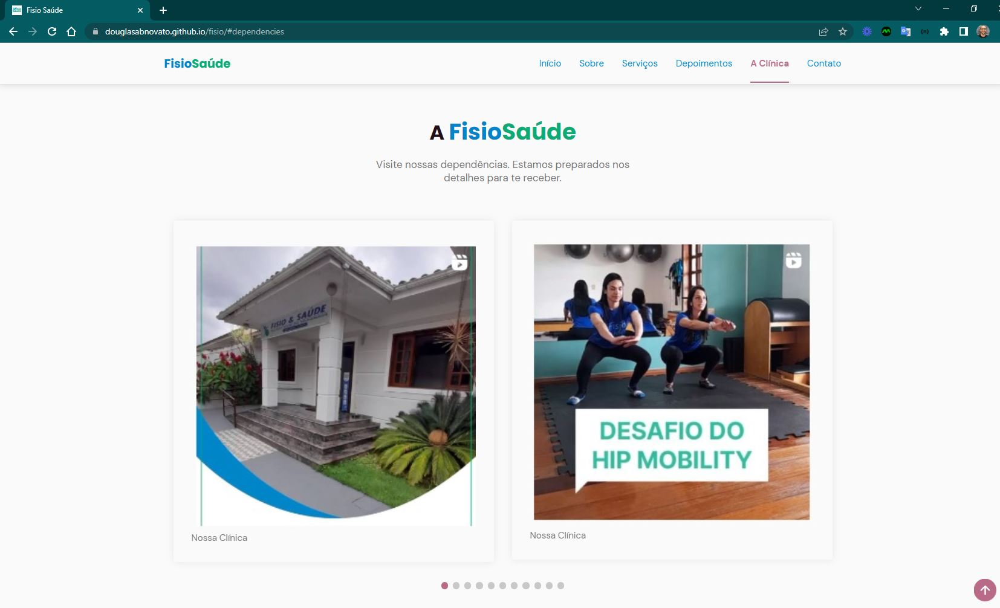
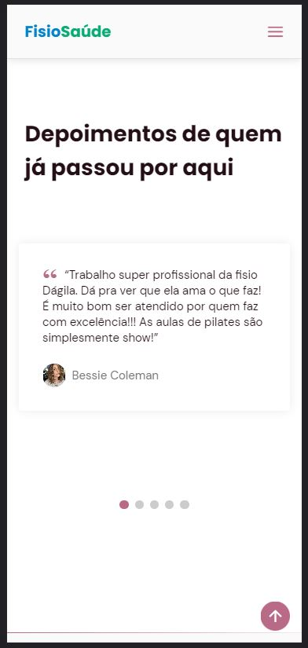

<h4 align="center"> 
	🚧 Fisio Saúde 🚀
</h4>

  

  

## 💻🔖 Organização do projeto 

Organizamos as branches para serem guardadas as versões do projeto
- main: em produção
- developer: em desenvolvimento das tarefas
- v-dev-fisio: primeira versão do projeto
- v-dev-meu-salao: segunda versão do projeto
 
## 💻🔖 sobre o projeto

- Site institucional da Fisio Saúde, uma clínica de fisioterapia.
- Montar uma documentação para o proprietário do site ter informações para consultar e entender as especificações.
- Fazer também uma proposta de orçamento para apresentar na reunião de demonstração.

#### Requisitos

- [x] cores da Identidade visual
- [x] logo
- [x] favicon
- [x] seção contato 
- [x] seção footer com redes sociais e mapa no endereço
- [x] seção depoimentos
- [x] seção a clínica com fotos das instalações
- [x] seção serviços com fotos dos procedimentos
- [x] responsividade
- [x] usabilidade em mobile
- [x] usabilidade em desktop
- [x] botão para abrir conversa no whatsapp
- [ ] botão para agendar um horário

### Telas Responsivas - Desktop e Mobile

  

  
  

  
  

  
  

  
  

  
  

  
  

  
  

#### Inspirações

- site de busca de [clínicas fisioterapeutas](https://buscafisio.com.br/fisio-saude-4)
- portal [de fisioterapia](https://www.loguei.com/segmentos/site-para-fisioterapeuta/)
- [ícones](https://www.flaticon.com/br/)
- [proposta-comercial-website-institucional](https://www.wibushi.com/pt/modelos/proposta-comercial-de-desenvolvimento-de-website-institucional/)
- [proposta-comercial-website-institucional - 1](https://app.wibushi.com/modelos/proposta-comercial-website-institucional/)
- [proposta-comercial-website-institucional - 2](https://proposeful.com/pt/about/proposta-desenvolvimento-sites/)

Feito com ❤️ por Douglas A B Novato 👋🏽 [Entre em contato!](https://www.linkedin.com/in/douglasabnovato/)
