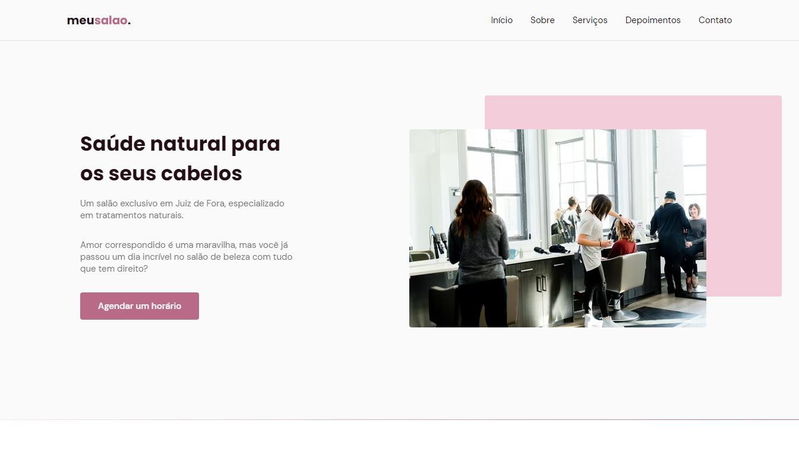
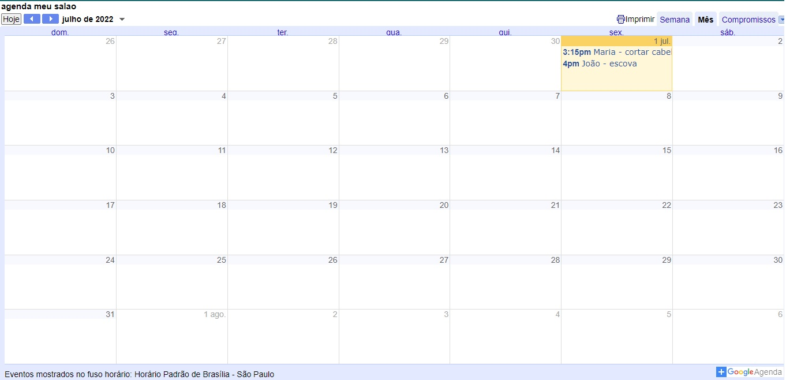
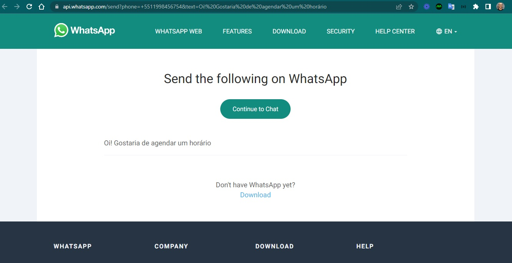
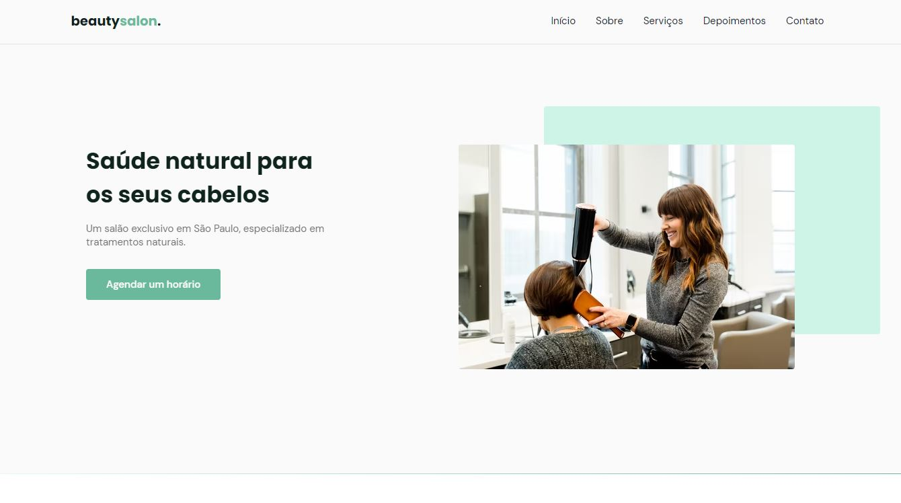
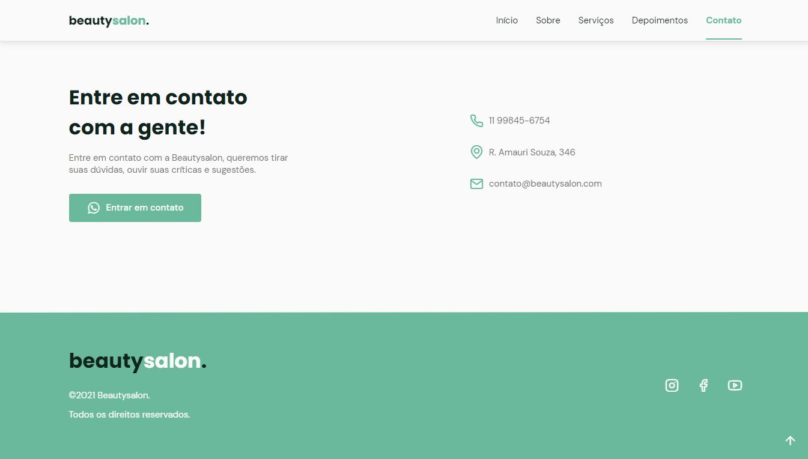

<h4 align="center"> 
	🚧 meu salao 🚀
</h4> 

<h1 align="center">
    
</h1>

Projeto open source de uma aplicação original para um salão de beleza.
Dividido em dois módulos, um para os clientes e outro para o ambiente do salão.

### Versão 3.0

Transformar o design conforme requisitos e inspirações.

- [x] 1. Adaptar template conforme as inspirações

  
  
  

 

### Versão 2.0

Evolução de layout inspirado no treinamento Origin-Six. É uma página institucional no formato One Page, responsiva que contém as seguintes seções: Header, Navigation, Home, Sobre, Serviços, Depoimentos, Contato e Footer.

- [x] 1. Novo template spa

  
  

 

#### 🔖 Detalhes no Notion

Podemos ver mais detalhes do projeto através [desse link](https://www.notion.so/Mission-Origin-003847efca1f4d8f938beb5c4f6a3578) no Notion.  

#### 🔖 Layout

Você pode visualizar o layout do projeto através [desse link](https://www.figma.com/community/file/1009807319507822993/Origin-Six). É necessário ter conta no [Figma](https://figma.com) para acessá-lo.

#### 🚀 Tecnologias

Esse projeto foi desenvolvido com as seguintes tecnologias:
- HTML
- CSS
- JavaScript

Bibliotecas
- [Google Fonts](https://fonts.google.com/)
- [SwipeJS](https://github.com/nolimits4web/Swiper)
- [ScrollRevel](https://scrollrevealjs.org)

Utilitários
- [randomuser.me](https://randomuser.me/photos)
- [IconMoon](https://icomoon.io/app/#/select)

### Versão 1.0

Primeira etapa de levantamento de requisitos.

- [x] 1. Inspiração - Brainding para construir a ideia do projeto.
- [x] 2. Papel e Caneta - Rascunhar telas no papel e caneta.

### 📝 Licença

Esse projeto está sob a licença MIT. Veja o arquivo [LICENSE](.github/LICENSE.md) para mais detalhes.

---  

Feito com ❤️ por Douglas A B Novato 👋🏽 [Entre em contato!](https://www.linkedin.com/in/douglasabnovato/) 
